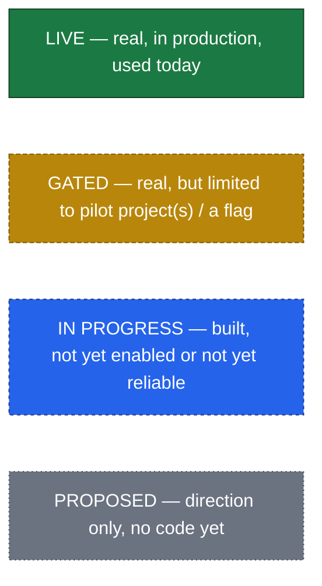

# Lognos — Workflow Blocks for the Animated Diagrams

Working basis for the next iteration of the animated flow diagrams on the site
(`91. SITE/lognos_github_page/v2/index_v2_01.html`). The site currently ships two
simplified, five/four-node terminal animations (hero + risk section). This doc
expands both into the real cascade — the queueing, the parallel inputs, and the
validation gates the simplified versions compress away — so the animation can be
rebuilt with accurate detail. Companion to `lognos_tech.md`; status tags use the
same convention.

## Status legend

Both diagrams below use the same four-way tag as `lognos_tech.md`. A node's color
in the animation should say something true about the system, not just look busy.

Shape convention used throughout: rectangles are automated processing steps,
diamonds are validation/decision gates, stadium shapes (rounded pills) are
points where a **named person** confirms something, cylinders are stored,
versioned system-of-record data, and parallelograms are data feeding in from
outside the cascade.

## How this maps to the current site animation

| Site animation node (today) | What it's standing in for below |
|---|---|
| Hero: "Site update" | `Field progress capture` |
| Hero: "Schedule" | `Schedule update queue` + `Guardrail validation` + `Schedule system of record` |
| Hero: "Cost forecast" | `Cost forecast engine` (plus the actuals/commitments feed and readiness check it compresses out) |
| Hero: "Monte Carlo" | `Risk Engine` composite simulation |
| Hero: "Report" | `Processed information` |
| Risk section: "World signal" + "Schedule update" | `Risk signal sources` (four sources, not two — see Diagram B) |
| Risk section: "Risk register" | `Identification & triage` + `Risk-action workflow` |
| Risk section: "Monte Carlo" / "Report" | `Quantitative layer` + `Processed information` |

Nothing below contradicts the current animation's story — it's the same loop,
just uncompressed. One correction worth carrying into the new version: the site
currently shows a single "Cost forecast" step feeding straight into "Monte
Carlo." In the real system these are two **different, separately computed**
results — a deterministic waterfall forecast, and a risk-adjusted composite
forecast produced inside the Monte Carlo step itself, never by re-running the
waterfall. Diagram A keeps them as distinct stages for that reason rather than
drawing "Cost forecast" twice.

---

## Diagram A — Main orchestration cascade

Field data enters, cascades through scheduling and cost, and reconciles inside
the risk engine, which also receives the parallel risk-management stream
(detailed in Diagram B). Validation gates sit at every domain boundary — a
change never crosses from one engine's system of record into the next
engine's inputs without one.

```mermaid
flowchart LR
    classDef live fill:#1b7a43,stroke:#123f24,color:#ffffff,stroke-width:1px;
    classDef gated fill:#b8860b,stroke:#7a5a06,color:#ffffff,stroke-width:1px,stroke-dasharray: 4 2;
    classDef inprogress fill:#2563eb,stroke:#1e3a8a,color:#ffffff,stroke-width:1px,stroke-dasharray: 3 3;
    classDef proposed fill:#6b7280,stroke:#374151,color:#ffffff,stroke-width:1px,stroke-dasharray: 1 3;
    classDef mixed fill:#7c3aed,stroke:#4c1d95,color:#ffffff,stroke-width:1px,stroke-dasharray: 2 4;

    subgraph FIELD["Field"]
        A1["Field progress capture"]:::live
    end

    subgraph SCHED["Scheduling engine"]
        direction LR
        B1["Schedule update queue<br/>triage: direct / mechanical fix / second-order / unclear"]:::live
        B2{"Guardrail validation"}:::live
        B2h(["Planner confirms<br/>(second-order / unclear only)"]):::live
        B3[("Schedule system of record")]:::live
        B4["CPM recalculation &<br/>candidate promotion"]:::gated
    end

    subgraph COST["Cost / forecast engine"]
        direction LR
        Cmap["Cost–schedule mapping<br/>(Smart Mapper)"]:::live
        C0[/"Cost actuals + commitments"/]:::live
        C0v{"Forecast readiness check"}:::live
        C1["Cost forecast engine<br/>waterfall: commitment + accrual"]:::live
        C2(["Cost controller signs off"]):::live
        C3[("Forecast snapshot, versioned")]:::live
    end

    subgraph RISKMGMT["Risk management workflow — Diagram B"]
        R0["Identification → workflow → register"]:::mixed
    end

    subgraph RISK["Risk engine"]
        direction LR
        D1["Composite Monte Carlo simulation<br/>cost × schedule × risk"]:::live
        D2[("Risk-adjusted forecast, stored")]:::live
    end

    subgraph OUT["Processed information"]
        direction LR
        E1["Report compiled<br/>project / risk / EVM status"]:::live
        E2(["PM confirms — the decision moment"]):::live
        E3["Delivered: app, Telegram, MCP,<br/>email (per project)"]:::live
        E4["Pending tasks surfaced to owners"]:::live
    end

    A1 --> B1 --> B2
    B2 -->|direct / mechanical fix, auto-applied| B3
    B2 -->|second-order / unclear, held| B2h --> B3
    B3 --> B4
    B3 --> C1
    B4 --> C1
    Cmap --> C0v
    C0 --> C0v
    C0v --> C1
    C1 --> C2 --> C3
    C3 --> D1
    R0 -.->|risk register + quantified actions| D1
    B3 -.->|schedule delta also raises risk signals| R0
    D1 --> D2 --> E1
    E1 --> E2 --> E3
    E3 --> E4
    E4 -.->|next reporting cycle| A1
    E4 -.->|review / validation tasks| R0
```

### Node notes

| Node | Backend reality | Status |
|---|---|---|
| Schedule update queue | Headless, cron-driven agent classifies every queued activity update into one of four buckets. Never writes itself. | `LIVE` |
| Guardrail validation | A separate deterministic service applies the actual write — direct changes and mechanical-integrity fixes go straight through; second-order changes and anything unclear are held with a drafted reply for a human. | `LIVE` |
| CPM recalculation & candidate promotion | Full calculate → validate → approve → promote → rollback lifecycle exists and is migrated, but is allowlisted to one pilot project; a second project's readiness review found it not yet ready (calendar/actuals data issues). Don't animate this as universal. | `GATED` |
| Cost–schedule mapping (Smart Mapper) | AI-assisted mapping of a client's cost breakdown to schedule activities and cost centers — this is what makes the actuals/commitments feed usable at all. | `LIVE` |
| Forecast readiness check | Explicit precondition gate — the forecast engine refuses to run on stale or missing inputs rather than silently producing a number. | `LIVE` |
| Cost forecast engine | Waterfall model, split into commitment forecast (procurement-driven) and accrual forecast (progress-driven). | `LIVE` |
| Risk management workflow (rollup) | Mixed maturity — identification and the register's read side are live; the durable multi-step write path is still being hardened. See Diagram B for the real per-stage picture; don't collapse it to one status. | `MIXED — see Diagram B` |
| Composite Monte Carlo simulation | Produces the risk-adjusted forecast from cost, schedule, and the risk register together — genuinely a different computation from the waterfall forecast above it. | `LIVE` |
| Delivered: app, Telegram, MCP, email | App and Telegram are unconditionally live; MCP read access is live; email delivery is live but gated per project and its most recent enabled-status was self-reported, not independently re-verified. | `LIVE` (email `GATED`) |

---

## Diagram B — Risk management, detailed

This is the zoom-in on the `RISKMGMT` block above: four signal sources feed
one identification/triage step, which both updates the register directly (for
reporting) and opens a governed action-review workflow.

```mermaid
flowchart LR
    classDef live fill:#1b7a43,stroke:#123f24,color:#ffffff,stroke-width:1px;
    classDef gated fill:#b8860b,stroke:#7a5a06,color:#ffffff,stroke-width:1px,stroke-dasharray: 4 2;
    classDef inprogress fill:#2563eb,stroke:#1e3a8a,color:#ffffff,stroke-width:1px,stroke-dasharray: 3 3;
    classDef proposed fill:#6b7280,stroke:#374151,color:#ffffff,stroke-width:1px,stroke-dasharray: 1 3;

    subgraph SIGNALS["Risk signal sources"]
        direction TB
        S1[/"Project communications<br/>email, Teams transcripts"/]:::live
        S2[/"Ingested documents<br/>SharePoint knowledge base"/]:::inprogress
        S3[/"External / world signals<br/>live web search"/]:::live
        S4[/"Schedule & cost deltas"/]:::live
    end

    subgraph IDENT["Identification & triage"]
        direction LR
        I1["Extraction + de-duplication"]:::live
        I2{"Match against<br/>existing register"}:::live
        I3["Classification &<br/>owner assignment"]:::live
    end

    subgraph WORKFLOW["Risk-action workflow"]
        direction LR
        W1(["Proposed"]):::live
        W2(["In review"]):::live
        W3{"Reviewer response<br/>approve / reject / request changes"}:::inprogress
        W4(["Final validation"]):::live
        W5(["Implementation complete"]):::live
    end

    subgraph QUANT["Quantitative layer"]
        direction LR
        Q1[("Risk register<br/>qualitative + quantitative")]:::live
        Q2["Composite Monte Carlo simulation"]:::live
    end

    subgraph OUT2["Processed information"]
        direction LR
        O1["Risk Board / status report"]:::live
        O2["Task surfaced to owner<br/>app, Telegram, email, MCP"]:::live
    end

    S1 --> I1
    S2 --> I1
    S3 --> I1
    S4 --> I1
    I1 --> I2 --> I3
    I3 --> Q1
    I3 --> W1 --> W2 --> W3
    W3 -->|approve| W4 --> W5 --> Q1
    W3 -->|reject / changes requested| W1
    Q1 --> Q2 --> O1 --> O2
    W2 -.->|assigned reviewer task| O2
```

### Node notes

| Node | Backend reality | Status |
|---|---|---|
| Project communications | Risks/actions are identified from pre-extracted signal already carried in the communications-memory store, with dedup, owner assignment, and evidence-backed update proposals (e.g. from meeting transcripts). | `LIVE` |
| Ingested documents | Pulling risks directly out of ingested documents (registers, reports), not only email/chat. Code-complete and migrated to production; still needs a live end-to-end run against a real client register. | `IN PROGRESS` |
| External / world signals | Native web search available to the risk agent during analysis. | `LIVE` |
| Match against existing register | Reconciliation that produces update *proposals* rather than duplicating an already-known risk. | `LIVE` |
| Proposed / In review / Final validation / Implementation complete | Real, tracked stages in the shared task/workflow engine — reading "what stage is this action in" is fully live and is the same read path the app and MCP both use. | `LIVE` |
| Reviewer response (approve / reject / request changes) | This is specifically the *commit* step — an agent or MCP client submitting a review decision that advances the task. The underlying transactional write path has draft, tested code but is blocked on unresolved review findings before wider use; only a narrow slice (submitting a review verdict on an already-assigned task) exists as unenabled draft code. Treat this one diamond as the actual gap — everything upstream and downstream of it is real. | `IN PROGRESS` |
| Risk register update (direct, read-side) | Identification/classification already writes the qualitative register today, independent of the governed multi-step action-review workflow above — that's why `I3` also feeds `Q1` directly. | `LIVE` |
| Composite Monte Carlo simulation | Same engine referenced in Diagram A — one computation, not a separate risk-specific model. | `LIVE` |

---

## Notes for whoever builds the animation

- **The honest failure states are the interesting part.** The current site
  animation only shows green checkmarks. The real system has three distinct
  "not a checkmark" states worth animating distinctly rather than collapsing
  into success: *held for a human* (second-order/unclear schedule changes,
  `B2h`), *blocked pending review* (the reviewer-response commit, `W3`), and
  *gated to a pilot* (CPM recalculation, `B4`). Showing at least one of these
  mid-animation is more credible than an unbroken chain of ticks, and it's
  consistent with the site's own "says what it doesn't know" positioning.
- **Two forecasts, not one.** If the redesign keeps a compressed single-row
  hero animation, keep the label distinction between the deterministic
  waterfall forecast and the risk-adjusted composite forecast even if they're
  visually adjacent — don't relabel both "Cost forecast."
- **Parallel entry points, not just parallel branches.** Diagram A has two
  independent triggers into the same cascade (field progress *and*
  cost actuals/commitments), and Diagram B has four independent triggers into
  risk identification. The current site animation shows one linear chain; the
  redesigned version should visually establish that the loop can start from
  more than one place.
- **The loop-back is real and already animated** (`conn-return` path in the
  current SVGs) — keep it. `E4 -.-> A1` and `E4 -.-> R0` above are the two
  places it should land: a new field cycle, and a new risk-review task.
